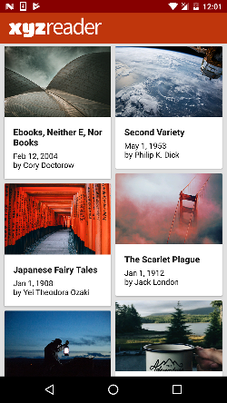
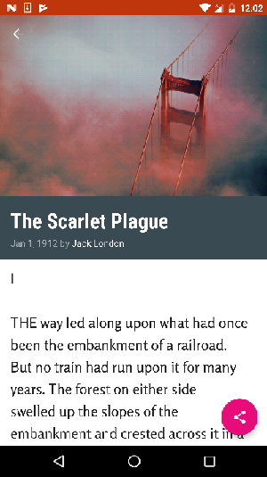

# XYZReader
XYZReader project is a part of Udacity's Android Developer Nanodegree coursework. In this demo project, with app reviews retrieved from users complaining about the quality of the app, lack of a consistent color theme, unreadable text and smooth transitioning between pages, the app has been redesigned to meet the Android Material Design guidelines.

 | 
